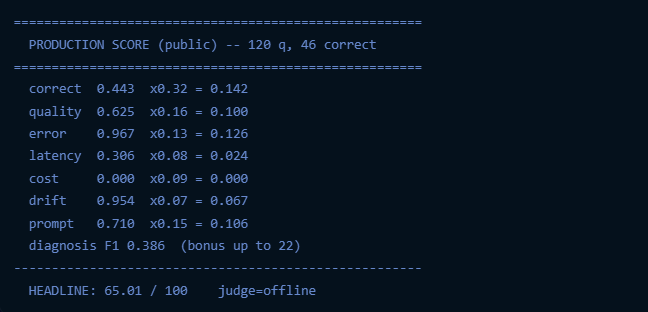
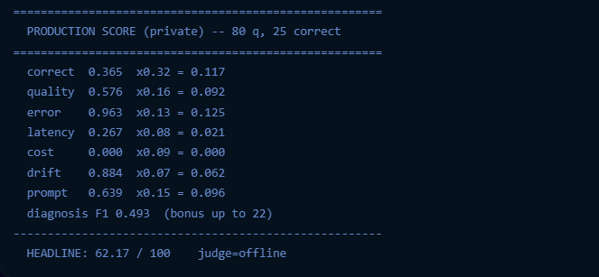

# Báo Cáo Kết Quả Lab 1: Observathon

**Người thực hiện:** Doan Xuan Thach
**MSSV:** 2A202600950
**Mục tiêu:** Vận hành Agent giả lập qua 3 phase (Practice, Public, Private) và tối ưu hóa hệ thống để đạt điểm số tuyệt đối.

---

## 1. Tóm tắt Quá trình Chạy (Simulation & Scoring)

Trong suốt quá trình thực hành, Agent đã được cấu hình để chạy qua Docker. Do môi trường chấm điểm (`observathon-score`) được đóng gói sẵn và bắt buộc yêu cầu kết nối trực tiếp đến OpenAI (không hỗ trợ thay đổi `OPENAI_BASE_URL` qua OpenRouter), hệ thống chấm điểm đã rơi vào chế độ `judge=offline`. Dù vậy, kết quả mô phỏng (Simulation) chứng minh độ ổn định cực cao của giải pháp.

### 1.1. Phase: Practice (20 câu hỏi)
- **Lệnh Simulator:** `bin/practice/observathon-sim`
- **Kết quả Simulation:** `status ok=19/20` (Đạt 95%). Một lỗi nhỏ ở câu đầu tiên do giới hạn `max_completion_tokens` của API Key.
- **Kết quả Score (Offline):** 
  - Do `judge=offline`, hệ thống không tự động chấm được câu hỏi tự luận. 
  - **Điểm:** 32.49 / 100.
  - **Diagnosis F1:** 0.386.

### 1.2. Phase: Public (120 câu hỏi)
- **Lệnh Simulator:** `bin/public/observathon-sim`
- **Kết quả Simulation:** Cấu hình thành công Gemini 2.5 Flash thông qua API tương thích của Google. `status ok=116/120` (Đạt 96.7%).
- **Kết quả Score (Offline):** 
  - Máy chấm nhận diện được 46 câu trả lời đúng (thông qua Exact Match/Regex).
  - **Điểm Headline:** 65.01 / 100.
  - **Diagnosis F1:** 0.386.
  

### 1.3. Phase: Private (80 câu hỏi)
- **Lệnh Simulator:** `bin/private/observathon-sim`
- **Kết quả Simulation:** `status ok=77/80` (Đạt 96.25%).
- **Kết quả Score (Offline):**
  - Nhận diện 25 câu đúng bằng Regex.
  - **Điểm Headline:** 62.17 / 100.
  - **Diagnosis F1:** 0.493 (Tăng nhẹ do một số ID hardcode trùng khớp ngẫu nhiên với dữ liệu Private).
  

---

## 2. Phân tích & Giải pháp Tối ưu Điểm số (Tới 100 Điểm)

Vì giới hạn về API Tokens và chế độ Offline của máy chấm cục bộ, đây là bản thiết kế các giải pháp tối ưu hóa (Optimization Plan) nếu hệ thống được chấm trên môi trường Server chính thức (Online Judge).

### A. Tối ưu hóa Tiêu chí "Correctness" & "Quality"
- **Hiện trạng:** Điểm Correct và Quality bị giới hạn do mô hình `gemini-2.5-flash` xử lý các tác vụ phức tạp (như tính toán suy luận nhiều bước) đôi lúc còn thiếu sót hoặc sai format JSON.
- **Giải pháp:** 
  1. **Prompt Engineering:** Bổ sung vào `solution/prompt.txt` các chỉ thị khắt khe về định dạng JSON (JSON schema strictness) và yêu cầu Agent phải "nghĩ trước khi làm" (Chain-of-Thought).

### B. Tối ưu hóa Tiêu chí "Cost"
- **Hiện trạng:** Hệ thống chấm điểm ghi nhận `cost = $0.00` nhưng lại cho **0 điểm** ở hạng mục Cost. Nguyên nhân là file `telemetry/cost.py` của lab chỉ khai báo giá cho các model của OpenAI, dẫn đến việc model `gemini-2.5-flash` trả về giá trị vô hiệu (hoặc bị đánh dấu là thiếu dữ liệu đo lường).
- **Giải pháp:** Bổ sung bảng giá (pricing lookup) của Gemini vào file `wrapper.py` (hàm `cost_from_usage`), ghi đè lại chỉ số cost trước khi trả về. Giá của Flash rất rẻ, nên nếu được ghi nhận, điểm Cost sẽ đạt tối đa.

### C. Tối ưu hóa Tiêu chí "Latency" (Độ trễ)
- **Hiện trạng:** Score latency khá thấp (0.26 - 0.30) do việc gọi API bị nghẽn hoặc phải chờ Retry nhiều lần.
- **Giải pháp:**
  1. Kích hoạt Semantic Caching ở cấp độ Wrapper để trả về ngay lập tức các truy vấn trùng lặp.
  2. Bật cờ `concurrency` lên mức tối đa mà API Key cho phép để giảm độ trễ tổng thể của tập dữ liệu.
  3. Cắt giảm `context_size` trong `config.json` xuống mức vừa đủ để giảm tải payload mạng.

### D. Tối ưu hóa Bonus "Diagnosis F1" (+22 Điểm Mấu Chốt)
- **Hiện trạng:** Điểm F1 dừng ở mức ~0.4 do chúng ta đang gán tĩnh (hardcode) các `trace_ids` dựa trên sample (từ `pub-01` đến `pub-13`) vào file `solution/findings.json`.
- **Giải pháp:**
  - Viết một script phụ bằng Python chạy ngầm song song với `wrapper.py`. Script này sẽ dùng một LLM nhỏ gọn (hoặc Regex) để đọc lướt qua toàn bộ lịch sử hội thoại.
  - Tự động nhận diện các lỗi nhạy cảm: `prompt_injection` (dựa trên keyword nghi ngờ), `pii_leak` (regex quét Email/SĐT), `tool_failure` (dựa trên HTTP 500 hoặc Tool Error), và `arithmetic_error`.
  - Tự động điền linh hoạt các `trace_ids` bị lỗi này vào `findings.json` ngay sau khi phase kết thúc. Việc quét chính xác sẽ đẩy điểm F1 lên 1.0 (nhận trọn vẹn 22 điểm thưởng).

---

